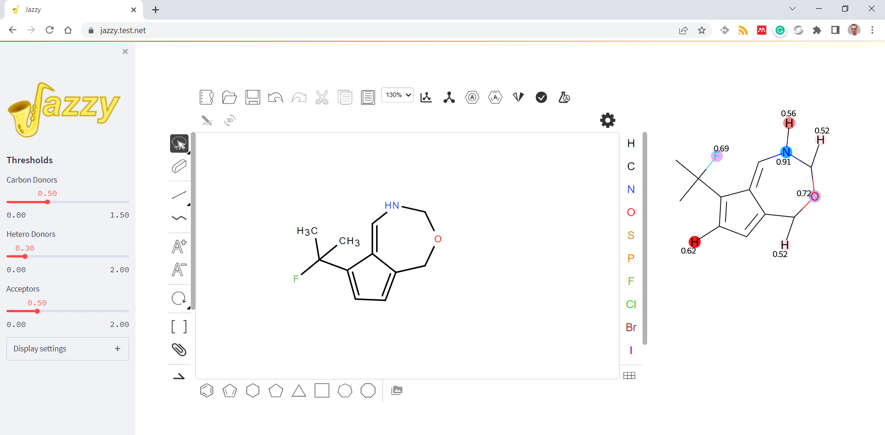

# Jazzy front end
## Description
Containerised Streamlit ([https://streamlit.io/](https://streamlit.io/)) front end that sits on top of Jazzy ([https://github.com/AstraZeneca/jazzy](https://github.com/AstraZeneca/jazzy)). The application uses Ketcher ([https://github.com/epam/ketcher](https://github.com/epam/ketcher)) to convert molecule drawings into atomic hydrogen-bond strength renderings. The tool can be used to sketch compounds and assess the effect of structural modifications against hydrogen-bonding.

The interface also includes a panel with three sliders that can be used to filter in/out atoms by configuring thresholds on their strength. The sliders can be used against hydrogens attached to hetero atoms, hydrogens attached to carbons, or hydrogen-bond acceptors.



## Technical details
- Ketcher is served as an 'iframed' version of the client widget at http://localhost:3000
- Streamlit embeds the client and runs at http://localhost:8501

## Usage
```bash
# Build and run the container in the background
# The service will be exposed on http://localhost:8501
docker build -t jazzyfront .
docker run -p 8501:8501 --rm --name jazzyfront jazzyfront
```

```bash
# Build and run the container interactively mounting the source directory
docker build -t jazzyfront .
docker run --rm -it -p 8501:8501 -p 3000:3000 --name jazzyfront --mount source=${PWD}/src,target=/app,type=bind jazzyfront /bin/bash
streamlit run app.py
```